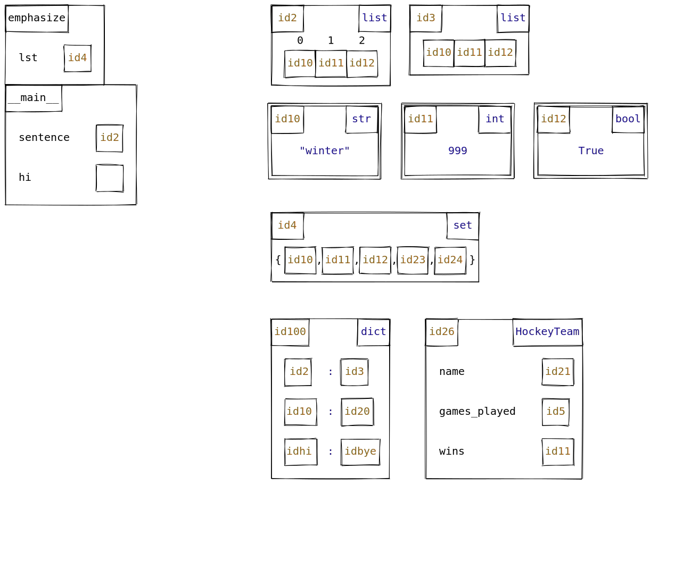

# Memory model diagrams

This package generates memory model diagrams for Python code in the style of CSC110/111/148 at the University of Toronto.
This uses the [Rough.js](https://roughjs.com/) Javascript library to emulate the look of hand-drawn diagrams.

**Note**: this project is currently experimental, and may undergo significant changes before stabilizing.

## Installation (users)

1. Install [Node.js](https://nodejs.org/en/).
2. Install the `memory-models-rough` package from GitHub (it is currently not on npm):

    ```console
    $ npm install git+https://github.com/david-yz-liu/memory-models-rough.git -g
    ```

    _Note_: omit the `-g` flag if you want to install the package into just the current working directory.

## Installation (developers)

1. First, clone this repository.
2. Install [Node.js](https://nodejs.org/en/).
3. Open a terminal in your local code of the repository, and then run:

    ```console
    $ npm install
    ```

4. Compile the Javascript assets using [webpack](https://webpack.js.org/guides/getting-started/):

    ```console
    $ npm run build
    ```

That's it!
You should then be able to try out the demo in the [Example usage](#example-usage) section below.

### Automatic Javascript compilation

Rather than running `npm run build` to recompile your Javascript bundle every time you make a change, you can instead run the following command:

```console
$ npm run watch
```

This will use `webpack` to watch for changes to the Javascript source files and recompile them automatically.

*Note*: this command will keep running until you manually terminate it (Ctrl + C), and so you'll need to open a new terminal window to enter new terminal commands like running the demo below.

## Example usage

```javascript
// In demo.js
const { MemoryModel } = require("memory-models-rough")

const m = new MemoryModel({ width: 1300, height: 1100 })

m.drawClass(10, 10, "emphasize", null, { lst: 4 }, true)
m.drawClass(10, 160, "__main__", null, { sentence: 2, hi: null }, true)
m.drawObject(510, 10, "list", 2, [10, 11, 12], true)
m.drawObject(770, 10, "list", 3, [10, 11, 12], false)
m.drawObject(510, 200, "str", 10, "winter")
m.drawObject(760, 200, "int", 11, 999)
m.drawObject(1010, 200, "bool", 12, true)
m.drawObject(510, 400, "set", 4, [10, 11, 12, 23, 24])
m.drawObject(510, 600, "dict", 100, { 2: 3, 10: 20, hi: "bye" })

m.drawClass(
    800,
    600,
    "HockeyTeam",
    26,
    { name: 21, games_played: 5, wins: 11 },
    false
)

m.save("demo.svg")
```

Running `node demo.js` creates a file `demo.svg` that contains the following image:


