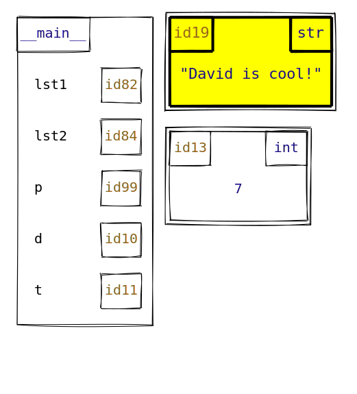

# MemoryViz

Welcome to the repository for the MemoryViz project!
MemoryViz is a visualization tool that generates memory model diagrams for Python code, aimed at students and educators.
MemoryViz is written in Javascript and is built on top of the [Rough.js](https://roughjs.com/) library.

For more information, check out our [demo](https://www.cs.toronto.edu/~david/memory-viz/demo/) [project documentation](https://www.cs.toronto.edu/~david/memory-viz/).

## Installation

Install MemoryViz using `npm` (requires [Node.js](https://nodejs.org/en) to be installed):

```console
$ npm install memory-viz
```

## Example

Given a JSON file [`demo.json`](examples/demo.json) that encodes a state of Python memory and some styling options:

```json
[
    {
        "type": ".frame",
        "name": "__main__",
        "id": null,
        "value": { "lst1": 82, "lst2": 84, "p": 99, "d": 10, "t": 11 }
    },
    {
        "type": "str",
        "id": 19,
        "value": "David is cool!",
        "style": ["highlight"]
    },
    {
        "type": "int",
        "id": 13,
        "value": 7
    }
]
```

you can run the following command in the terminal:

```console
$ npx memory-viz --output demo_output.svg demo.json
```

This producs an SVG file, `demo_output.svg`, that visualizes the state of memory:



## About this repository

This repository contains multiple [npm workspaces](https://docs.npmjs.com/cli/v7/using-npm/workspaces) that contains the MemoryViz-related projects.

- [memory-viz/](memory-viz/) is the source code for the main `memory-viz` Javascript package
- [demo/](demo/) contains the source code for the [demo website](https://www.cs.toronto.edu/~david/memory-viz/demo/)
- [docs/](docs/) contains the source code for the [project documentation website](https://www.cs.toronto.edu/~david/memory-viz/)
- [webstepper/](webstepper/) contains the source code for the Webstepper project, which integrates MemoryViz and [PythonTA](https://www.cs.toronto.edu/~david/pyta/)

## Developers

### Installation

1. Install [Node.js](https://nodejs.org/en/).
2. Clone the MemoryViz repository and `cd` into it:

    ```console
    $ git clone https://github.com/david-yz-liu/memory-viz.git
    $ cd memory-viz
    ```

3. Install the dependencies:

    ```console
    $ npm install
    ```

4. Install the pre-commit hooks to automatically format your code when you make commits:

    ```console
    $ npx husky init
    ```

5. Compile the MemoryViz library:

    ```console
    $ npm run build-dev --workspace=memory-viz
    ```

6. Run the test suite to check that all tests pass:

    ```console
    $ npm test
    ```

### Building and running the documentation website

See [`docs/README.md`](docs/README.md).

### Building and running the demo website

See [`demo/README.md`](demo/README.md).
