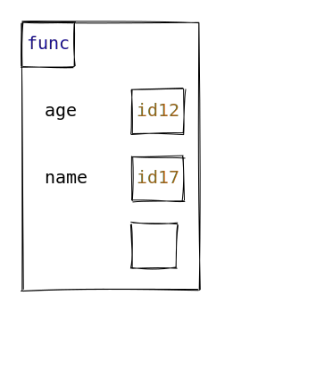

# JSON Format of `objects` argument in `draw` function

The `draw` function defined in `user_functions.ts` has an `objects` argument which is used to define the array of objects that is drawn on the canvas.
One way to populate the `objects` argument is by using a JSON file containing the object array.

## Core Attributes

All drawable JSON objects include the following core attributes, unless explicitly stated otherwise:

| Attribute | Type                | Required | Description                                                                                                                             |
| --------- | ------------------- | -------- | --------------------------------------------------------------------------------------------------------------------------------------- |
| `type`    | `string`            | Yes      | Specifies the type of object to be drawn. (e.g., `.class`, `.frame`, `int`, `str`). See [Object Types](#object-types) for more details. |
| `id`      | `number` or `null`  | Yes      | A unique identifier for the object. Must be `null` for stack frames. May be `null` anywhere to render a blank ID box.                   |
| `value`   | `any`               | Yes      | The content of the object to be drawn. Format depends on the [object type](#object-types).                                              |
| `x`, `y`  | `number`            | No       | The x and y coordinates for the object on the canvas. Required only if the `automation` parameter of `draw` is `false`.                 |
| `style`   | `object` or `array` | No       | Custom visual styling. See [Style API](06-cli.md) for more details.                                                                     |

[//]: # "| `show_indexes` | `boolean` | No | Applicable only for sequences (lists or tuples). Indicates whether to show indices in the memory box. Defaults to `false`. |"

---

## Object Types

| Type Value                            | Description       | Jump to more info               |
| ------------------------------------- | ----------------- | ------------------------------- |
| `.frame`                              | Stack frame       | [Stack Frames](#stack-frames)   |
| `.class`                              | Class box         | [Classes](#classes)             |
| `.blank-frame`                        | Blank stack frame | [Blank Frames](#blank-frames)   |
| `.blank`                              | Blank space       | [Blank Objects](#blank-objects) |
| `list`                                | List/array        | [Lists](#lists)                 |
| `tuple`                               | Tuple             | [Tuples](#tuples)               |
| `set`                                 | Set               | [Sets](#sets)                   |
| `dict`                                | Dictionary        | [Dictionaries](#dictionaries)   |
| `int`, `str`, `bool`, `float`, `None` | Primitive types   | [Primitives](#primitives)       |

---

### Stack Frames

| Attribute | Type                | Required | Description                                                                                                                                                                                                                                        |
| --------- | ------------------- | -------- | -------------------------------------------------------------------------------------------------------------------------------------------------------------------------------------------------------------------------------------------------- |
| `type`    | `string`            | Yes      | Must be `.frame` to indicate a stack frame.                                                                                                                                                                                                        |
| `id`      | `null`              | Yes      | Must be `null` for stack frames                                                                                                                                                                                                                    |
| `name`    | `string`            | Yes      | The name of the stack frame (e.g., `__main__`, `foo`)                                                                                                                                                                                              |
| `value`   | `object`            | Yes      | A mapping of variable names (as keys) to object IDs (as values). These represent the local variables in the scope of the frame. Variable names may be empty strings (`""`) and attribute values may be `null` to render blank boxes, respectively. |
| `x`, `y`  | `number`            | No       | Optional manual coordinates. Required only if `automation` is disabled.                                                                                                                                                                            |
| `style`   | `object` or `array` | No       | Custom visual styling.                                                                                                                                                                                                                             |

<details>
<summary>**Examples**</summary>
```json
{
    "type": ".frame",
    "name": "__main__",
    "id": null,
    "value": {
        "lst1": 82,
        "lst2": 84,
        "p": 99,
        "d": 10,
        "t": 11
    }
}
```
```json
{
    "type": ".frame",
    "name": "func",
    "id": null,
    "value": {
        "age": 12,
        "name": 17,
        "": null
    }
}
```

</details>

### Classes

| Attribute | Type                | Required | Description                                                                                                                                                                           |
| --------- | ------------------- | -------- | ------------------------------------------------------------------------------------------------------------------------------------------------------------------------------------- |
| `type`    | `string`            | Yes      | Must be set to `.class` to indicate a class object.                                                                                                                                   |
| `id`      | `number`            | Yes      | Unique identifier for the class object.                                                                                                                                               |
| `name`    | `string`            | Yes      | The name of the class being drawn.                                                                                                                                                    |
| `value`   | `object`            | Yes      | A mapping of attribute names (as keys) to object IDs (as values). Attribute names may be empty strings (`""`) and attribute values may be `null` to render blank boxes, respectively. |
| `x`, `y`  | `number`            | No       | Optional manual coordinates. Required only if `automation` is disabled.                                                                                                               |
| `style`   | `object` or `array` | No       | Custom visual styling.                                                                                                                                                                |

### Blank Frames

| Attribute | Type     | Required | Description                                              |
| --------- | -------- | -------- | -------------------------------------------------------- |
| `type`    | `string` | Yes      | Must be set to `.blank-frame` to indicate a blank frame. |
| `width`   | `number` | Yes      | The width of the blank frame.                            |
| `height`  | `number` | Yes      | The height of the blank frame.                           |

### Blank Objects

| Attribute | Type     | Required | Description                                         |
| --------- | -------- | -------- | --------------------------------------------------- |
| `type`    | `string` | Yes      | Must be set to `.blank` to indicate a blank object. |
| `width`   | `number` | Yes      | The width of the blank object.                      |
| `height`  | `number` | Yes      | The height of the blank object.                     |

### Lists

| Attribute      | Type                | Required | Description                                                               |
| -------------- | ------------------- | -------- | ------------------------------------------------------------------------- |
| `type`         | `string`            | Yes      | Must be set to `list` to indicate a list object.                          |
| `id`           | `number`            | Yes      | Unique identifier for the list.                                           |
| `value`        | `array`             | Yes      | List of object ids. Values can be made `null` to draw blank boxes.        |
| `show_indexes` | `boolean`           | No       | Indicates whether to show indices in the memory box. Defaults to `false`. |
| `x`, `y`       | `number`            | No       | Optional manual coordinates. Required only if `automation` is disabled.   |
| `style`        | `object` or `array` | No       | Custom visual styling.                                                    |

### Tuples

| Attribute      | Type                | Required | Description                                                               |
| -------------- | ------------------- | -------- | ------------------------------------------------------------------------- |
| `type`         | `string`            | Yes      | Must be set to `tuple` to indicate a tuple object.                        |
| `id`           | `number`            | Yes      | Unique identifier for the tuple.                                          |
| `value`        | `array`             | Yes      | List of object ids. Values can be made `null` to draw blank boxes.        |
| `show_indexes` | `boolean`           | No       | Indicates whether to show indices in the memory box. Defaults to `false`. |
| `x`, `y`       | `number`            | No       | Optional manual coordinates. Required only if `automation` is disabled.   |
| `style`        | `object` or `array` | No       | Custom visual styling.                                                    |

### Sets

| Attribute | Type                | Required | Description                                                             |
| --------- | ------------------- | -------- | ----------------------------------------------------------------------- |
| `type`    | `string`            | Yes      | Must be set to `set` to indicate a set object.                          |
| `id`      | `number`            | Yes      | Unique identifier for the set.                                          |
| `value`   | `array`             | Yes      | List of object ids. Values can be made `null` to draw blank boxes.      |
| `x`, `y`  | `number`            | No       | Optional manual coordinates. Required only if `automation` is disabled. |
| `style`   | `object` or `array` | No       | Custom visual styling.                                                  |

### Dictionaries

| Attribute | Type                | Required | Description                                                             |
| --------- | ------------------- | -------- | ----------------------------------------------------------------------- |
| `type`    | `string`            | Yes      | Must be set to `dict` to indicate a dictionary object.                  |
| `id`      | `number`            | Yes      | Unique identifier for the dictionary.                                   |
| `value`   | `dict`              | Yes      | Dictionary of `string` key to `int` object id value pairs.              |
| `x`, `y`  | `number`            | No       | Optional manual coordinates. Required only if `automation` is disabled. |
| `style`   | `object` or `array` | No       | Custom visual styling.                                                  |

### Primitives

| Attribute | Type                | Required | Description                                                                                                        |
| --------- | ------------------- | -------- | ------------------------------------------------------------------------------------------------------------------ |
| `type`    | `string`            | Yes      | Must be set to one of `int`, `str`, `bool`, `float`, or `None` to indicate a primitive object.                     |
| `id`      | `number`            | Yes      | Unique identifier for the primitive object.                                                                        |
| `value`   | `any`               | Yes      | The actual value represented by the primitive object. Value may be an empty string (`""`) to render a blank space. |
| `x`, `y`  | `number`            | No       | Optional manual coordinates. Required only if `automation` is disabled.                                            |
| `style`   | `object` or `array` | No       | Custom visual styling.                                                                                             |

[//]: # "# Structure of `objects` argument in `draw` function"
[//]: #
[//]: # "Arguably the most significant parameter the user has to specify for the `draw` function is `objects`, representing"
[//]: # "the array of objects to be drawn."
[//]: #
[//]: # "To be successfully rendered, the array must contain objects that strictly follow a specific structure. Every object"
[//]: # "must contain the following attributes:"
[//]: #
[//]: # "- `type` - `string`: Specifies whether a class, stack frame, or object is being drawn. To draw a class, input `.class` and to draw a stack frame, input `.frame`. If an object is being drawn, input the type of the object."
[//]: # "- `name` - `string`: The name of the class or stack frame to be drawn. Note that this attribute is only"
[//]: # "  applicable if the object's type is `.class` or `.frame`. Otherwise, this attribute can be excluded from the input."
[//]: # "- If the user wants to hardcode the coordinates (implying the `automation` parameter of `draw` is false), each object"
[//]: # "  must include `x` and `y` attributes (for x-y coordinates)."
[//]: # "- `id` - `string`|`number`: Denotes the id value of this object. If we are to draw a stack frame, then this MUST be `null`."
[//]: # "- `value` - `*`: Denotes the value of the object. This could be anything, from an empty string to a JS object,"
[//]: # "  which would be passed for the purpose of drawing a user-defined class object, a"
[//]: # "  stack frame, or a dictionary."
[//]: # "  **Note that in such cases where we want to draw a 'container'"
[//]: # "  object (an object that contains other objects), we pass a _JS object_ where the keys are the"
[//]: # "  attributes/variables and the values are the id's of the corresponding objects (not the"
[//]: # "  objects themselves)**."
[//]: # "- `show_indexes` - `boolean`: This is applicable only when drawing tuples or lists (when drawSequence"
[//]: # "  method will be used). It denotes whether the memory box of the underlying"
[//]: # "  sequence will include indices (for sequences) or not. This"
[//]: # "  has a default value of `false`, and it should be manually set to `true`"
[//]: # "  only if the object corresponds to a sequence (list or"
[//]: # "  tuple)."
[//]: # '- `style` - `object` | `array`: A JS object or array specifying the "style" of the object. See `style.md` for information'
[//]: # "  on the required structure (also see `presets.md` for the full capabilities)."
[//]: #
[//]: # "### Examples"
[//]: #
[//]: # "```javascript"
[//]: # "{"
[//]: # '    "type": ".frame",'
[//]: # '    "name": "__main__",'
[//]: # '    "id": null,'
[//]: # '    "value": {"lst1": 82, "lst2": 84, "p": 99, "d": 10, "t": 11}'
[//]: # "}"
[//]: #
[//]: # "{"
[//]: # '    "type": ".frame",'
[//]: # '    "name": "func",'
[//]: # '    "id": null,'
[//]: # '    "value": {"age": 12, "name": 17}'
[//]: # "}"
[//]: #
[//]: # '{"type": ".blank-frame", "width": 100, "height": 200}'
[//]: #
[//]: # '{"type": "list", "id": 82, "value": [19, 43, 28, 49]}'
[//]: #
[//]: # '{"type": "list", "id": 84, "value": [32, 10, 90, 57], "show_indexes": true}'
[//]: #
[//]: # '{"type": "int", "id": 19, "value": 1969}'
[//]: #
[//]: # '{"type": "bool", "id": 32, "value": true}'
[//]: #
[//]: # '{"type": ".blank", "width": 200, "height": 100}'
[//]: #
[//]: # '{"type": "str", "id": 43, "value": "David is cool"}'
[//]: #
[//]: # '{"type": "tuple", "id": 11, "value": [82, 76]}'
[//]: #
[//]: # '{"type": "set", "id": 90, "value": [36, 49, 64]}'
[//]: #
[//]: # '{"type": "dict", "id": 10, "value": {"x": 81, "y": 100, "z": 121}}'
[//]: #
[//]: # '{"type": "None", "id": 13, "value": "None",'
[//]: # '    "style": {'
[//]: # '      "text_value" : {"font-style": "italic"},'
[//]: # '      "box_id": {"fill": "red", "fillStyle": "dots"},'
[//]: # '      "box_type": {"fill": "red", "fillStyle": "solid"},'
[//]: # '      "box_container": {"fill":"black", "fillStyle": "solid"}}'
[//]: # "}"
[//]: # "```"
