import useBaseUrl from "@docusaurus/useBaseUrl";
import ThemedImage from "@theme/ThemedImage";

# Entity Specification

> :warning: Dark mode may make example images harder to see.

The `draw` function has an `objects` argument which is used to define the array of entities (type `DrawnEntity`) to be rendered on the canvas.
This page documents the attributes of the `DrawnEntity` object type and provides examples for the different kinds of entities supported by MemoryViz.

## Core Attributes

All supported entities include the following core attributes, unless explicitly stated otherwise:

| Attribute         | Type                | Required | Description                                                                                                                                 |
| :---------------- | :------------------ | :------- | :------------------------------------------------------------------------------------------------------------------------------------------ |
| `type`            | `string`            | Yes      | Specifies the type of object to be drawn. (e.g., `.class`, `.frame`, `int`, `str`). See [Entity Type](#entity-type) for more details.       |
| `id`              | `number` or `null`  | Yes      | A unique identifier for the object. May be `null` anywhere to render a blank ID box.                                                        |
| `value`           | `any`               | Yes      | The content of the object to be drawn. Format depends on the [entity type](#entity-type).                                                   |
| `x`, `y`          | `number`            | No       | The x and y coordinates for the object on the canvas. Required only if the `automation` parameter of `draw` is `false`.                     |
| `style`           | `object` or `array` | No       | Custom visual styling. See [Style API](04-style.md) for more details.                                                                       |
| `width`, `height` | `number`            | No       | The height and width for the object. If defined height and width is smaller than the automatically calculated, then it will be overwritten. |

### Entity Type

| Type Value                            | Description                     |
| :------------------------------------ | :------------------------------ |
| `int`, `float`, `str`, `bool`, `None` | [Primitives](#primitives)       |
| `list`, `tuple`                       | [Sequences](#sequences)         |
| `set`                                 | [Sets](#sets)                   |
| `dict`                                | [Dictionaries](#dictionaries)   |
| `.class`                              | [Classes](#classes)             |
| `.frame`                              | [Stack Frames](#stack-frames)   |
| `.blank` `.blank-frame`               | [Blank Objects](#blank-objects) |

## Primitives

| Attribute         | Type                | Required | Description                                                                                                               |
| :---------------- | :------------------ | :------- | :------------------------------------------------------------------------------------------------------------------------ |
| `type`            | `string`            | Yes      | Must be set to one of `int`, `str`, `bool`, `float`, or `None` to indicate a primitive object.                            |
| `id`              | `number`            | Yes      | Unique identifier for the primitive object.                                                                               |
| `value`           | `any`               | No       | The actual value represented by the primitive object. To render an empty box, set the value as `null` or don't define it. |
| `x`, `y`          | `number`            | No       | Optional manual coordinates. Required only if `automation` is disabled.                                                   |
| `style`           | `object` or `array` | No       | Custom visual styling.                                                                                                    |
| `width`, `height` | `number`            | No       | The height and width for the primitive object.                                                                            |

#### Examples

<details>
    <summary>**Integer**</summary>
        ```json
        {
            "type": "int",
            "id": 19,
            "value": 124
        }
        ```
        <ThemedImage
          alt="Example Integer"
          sources={{
            light: useBaseUrl('img/int.svg'),
            dark: useBaseUrl('img/int_dark.svg'),
          }}
        />
</details>
<details>
    <summary>**Blank integer**</summary>
        ```json
        {
            "type": "int",
            "id": 19,
            "value": ""
        }
        ```
        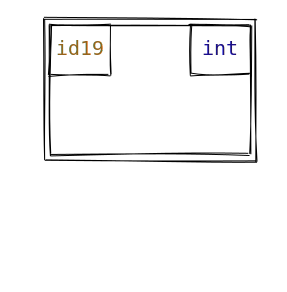
</details>
<details>
    <summary>**String**</summary>
        ```json
        {
            "type": "str",
            "id": 43,
            "value": "David is cool"
        }
        ```
        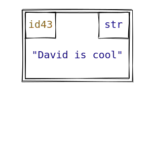
</details>
<details>
    <summary>**Boolean**</summary>
        ```json
        {
            "type": "bool",
            "id": 32,
            "value": true
        }
        ```
        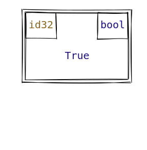
</details>
<details>
    <summary>**Float**</summary>
        ```json
        {
            "type": "float",
            "id": 76,
            "value": 3.14
        }
        ```
        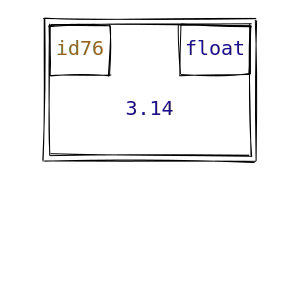
</details>
<details>
    <summary>**Blank float**</summary>
        ```json
        {
            "type": "float",
            "id": 76,
            "value": ""
        }
        ```
        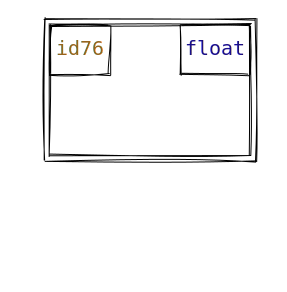
</details>
<details>
    <summary>**None**</summary>
        ```json
        {
            "type": "None",
            "id": 0,
            "value": "None"
        }
        ```
        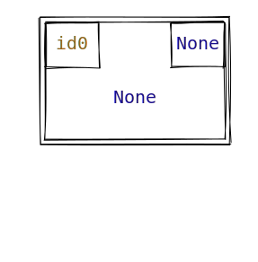
</details>
<details>
    <summary>**Empty Box**</summary>
        ```json
        {
            "type": "bool",
            "id": 0,
            "value": null
        }
        ```
        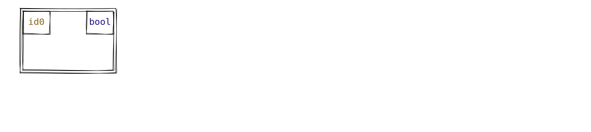
</details>

## Sequences

| Attribute         | Type                | Required | Description                                                                             |
| :---------------- | :------------------ | :------- | :-------------------------------------------------------------------------------------- |
| `type`            | `string`            | Yes      | Must be set to `list` to indicate a list object, or `tuple` to indicate a tuple object. |
| `id`              | `number`            | Yes      | Unique identifier for the sequence.                                                     |
| `value`           | `array`             | Yes      | List of object ids. Values can be made `null` to draw blank boxes.                      |
| `show_indexes`    | `boolean`           | No       | Indicates whether to show indices in the memory box. Defaults to `false`.               |
| `x`, `y`          | `number`            | No       | Optional manual coordinates. Required only if `automation` is disabled.                 |
| `style`           | `object` or `array` | No       | Custom visual styling.                                                                  |
| `width`, `height` | `number`            | No       | The height and width for the sequence.                                                  |

#### Examples

<details>
    <summary>**List with blank boxes**</summary>
        ```json
        {
            "type": "list",
            "id": 82,
            "value": [19, 43, null, 49]
        }
        ```
        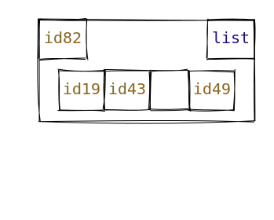
</details>
<details>
    <summary>**List with indices shown**</summary>
        ```json
        {
            "type": "list",
            "id": 84,
            "value": [32, 10, 90, 57],
            "show_indexes": true
        }
        ```
        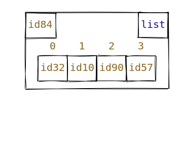
</details>
<details>
    <summary>**Tuple with blank boxes**</summary>
        ```json
        {
            "type": "tuple",
            "id": 11,
            "value": [82, 76, null]
        }
        ```
        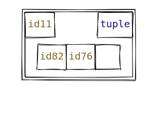
</details>
<details>
<summary>**Tuple with indices shown**</summary>
        ```json
        {
            "type": "tuple",
            "id": 11,
            "value": [82, 76, null],
            "show_indexes": true
        }
        ```
        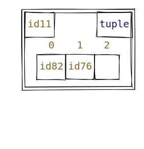
</details>

## Sets

| Attribute         | Type                | Required | Description                                                             |
| :---------------- | :------------------ | :------- | :---------------------------------------------------------------------- |
| `type`            | `string`            | Yes      | Must be set to `set` to indicate a set object.                          |
| `id`              | `number`            | Yes      | Unique identifier for the set.                                          |
| `value`           | `array`             | Yes      | List of object ids. Values can be made `null` to draw blank boxes.      |
| `x`, `y`          | `number`            | No       | Optional manual coordinates. Required only if `automation` is disabled. |
| `style`           | `object` or `array` | No       | Custom visual styling.                                                  |
| `width`, `height` | `number`            | No       | The height and width for the set.                                       |

#### Examples

<details>
    <summary>**Set with blank boxes**</summary>
        ```json
        {
            "type": "set",
            "id": 90,
            "value": [36, 49, null, 64]
        }
        ```
        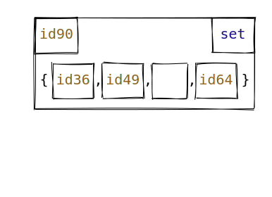
</details>
<details>
    <summary>**Set with large width**</summary>
    ```json
        { "type": "set", 
            "id": 32, 
            "value": [10, 11, 12], 
            "width": 500 
        }
    ```
    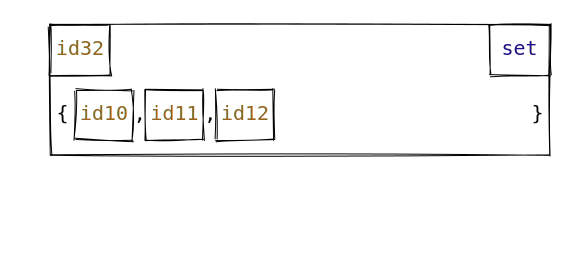
</details>

## Dictionaries

| Attribute         | Type                | Required | Description                                                                                                                                                               |
| :---------------- | :------------------ | :------- | :------------------------------------------------------------------------------------------------------------------------------------------------------------------------ |
| `type`            | `string`            | Yes      | Must be set to `dict` to indicate a dictionary object.                                                                                                                    |
| `id`              | `number`            | Yes      | Unique identifier for the dictionary.                                                                                                                                     |
| `value`           | `dict`              | Yes      | Dictionary of `string` object id keys to `int` object id value pairs. Keys can be made empty or all-whitespace strings and values can be made `null` to draw blank boxes. |
| `x`, `y`          | `number`            | No       | Optional manual coordinates. Required only if `automation` is disabled.                                                                                                   |
| `style`           | `object` or `array` | No       | Custom visual styling.                                                                                                                                                    |
| `width`, `height` | `number`            | No       | The height and width for the dictionary.                                                                                                                                  |

#### Examples

<details>
    <summary>**Dictionary with blank boxes**</summary>
        ```json
        {
            "type": "dict",
            "id": 10,
            "value": {
                "": 81,
                "1": null,
                "    ": 12
            }
        }
        ```
        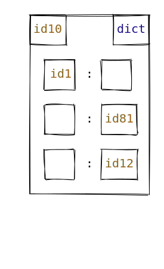
</details>
<details>
    <summary>**Dictionary with large height**</summary>
    ```json
        { "type": "dict", 
            "id": 10, 
            "value": { "x": 81, "y": 100, "z": 121 }, 
            "height": 600 
        }
    ```
    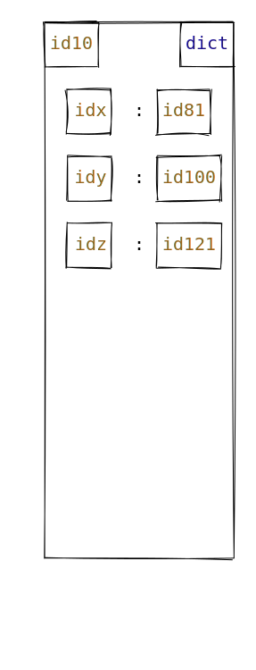
</details>

## Classes

| Attribute         | Type                | Required | Description                                                                                                                                                                                      |
| :---------------- | :------------------ | :------- | :----------------------------------------------------------------------------------------------------------------------------------------------------------------------------------------------- |
| `type`            | `string`            | Yes      | Must be set to `.class` to indicate a class object.                                                                                                                                              |
| `id`              | `number`            | Yes      | Unique identifier for the class object.                                                                                                                                                          |
| `name`            | `string`            | Yes      | The name of the class being drawn.                                                                                                                                                               |
| `value`           | `object`            | Yes      | A mapping of attribute names (as keys) to object IDs (as values). Attribute names may be empty or all-whitespace strings and attribute values may be `null` to render blank boxes, respectively. |
| `x`, `y`          | `number`            | No       | Optional manual coordinates. Required only if `automation` is disabled.                                                                                                                          |
| `style`           | `object` or `array` | No       | Custom visual styling.                                                                                                                                                                           |
| `width`, `height` | `number`            | No       | The height and width for the class.                                                                                                                                                              |

#### Examples

<details>
    <summary>**Class with blank boxes**</summary>
        ```json
        {
            "type": ".class",
            "id": 82,
            "name": "Person",
            "value": {
                "age": 12,
                "name": 17,
                "": null
            }
        }
        ```
        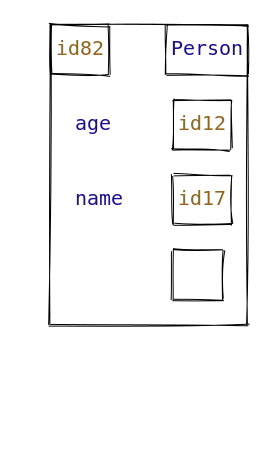
</details>

## Stack Frames

| Attribute         | Type                | Required | Description                                                                                                                                                                                                                                                   |
| :---------------- | :------------------ | :------- | :------------------------------------------------------------------------------------------------------------------------------------------------------------------------------------------------------------------------------------------------------------ |
| `type`            | `string`            | Yes      | Must be `.frame` to indicate a stack frame.                                                                                                                                                                                                                   |
| `id`              | `null`              | No       | Ignored for stack frames and not rendered regardless of value.                                                                                                                                                                                                |
| `name`            | `string`            | Yes      | The name of the stack frame (e.g., `__main__`, `foo`)                                                                                                                                                                                                         |
| `value`           | `object`            | Yes      | A mapping of variable names (as keys) to object IDs (as values). These represent the local variables in the scope of the frame. Variable names may be empty or all-whitespace strings and attribute values may be `null` to render blank boxes, respectively. |
| `x`, `y`          | `number`            | No       | Optional manual coordinates. Required only if `automation` is disabled.                                                                                                                                                                                       |
| `style`           | `object` or `array` | No       | Custom visual styling.                                                                                                                                                                                                                                        |
| `width`, `height` | `number`            | No       | The height and width for the class.                                                                                                                                                                                                                           |

#### Examples

<details>
    <summary>**Main stack frame**</summary>
        ```json
        {
            "type": ".frame",
            "name": "__main__",
            "value": {
                "lst1": 82,
                "lst2": 84,
                "p": 99,
                "d": 10,
                "t": 11
            }
        }
        ```
        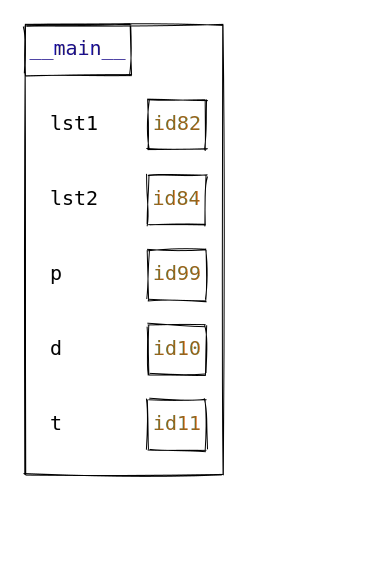
</details>
<details>
    <summary>**Function stack frame with blank boxes**</summary>
        ```json
        {
            "type": ".frame",
            "name": "func",
            "value": {
                "age": 12,
                "name": 17,
                "": null
            }
        }
        ```
        
</details>

## Blank Objects

| Attribute | Type     | Required | Description                                                                                      |
| :-------- | :------- | :------- | :----------------------------------------------------------------------------------------------- |
| `type`    | `string` | Yes      | Must be set to `.blank` to indicate a blank object, or `.blank-frame` to indicate a blank frame. |
| `width`   | `number` | Yes      | The width of the blank object/frame.                                                             |
| `height`  | `number` | Yes      | The height of the blank object/frame.                                                            |

#### Examples

<details>
    <summary>**Blank object**</summary>
        ```json
        {
            "type": ".blank",
            "width": 200,
            "height": 100
        }
        ```
</details>
<details>
    <summary>**Blank frame**</summary>
        ```json
        {
            "type": ".blank-frame",
            "width": 200,
            "height": 100
        }
        ```
</details>
