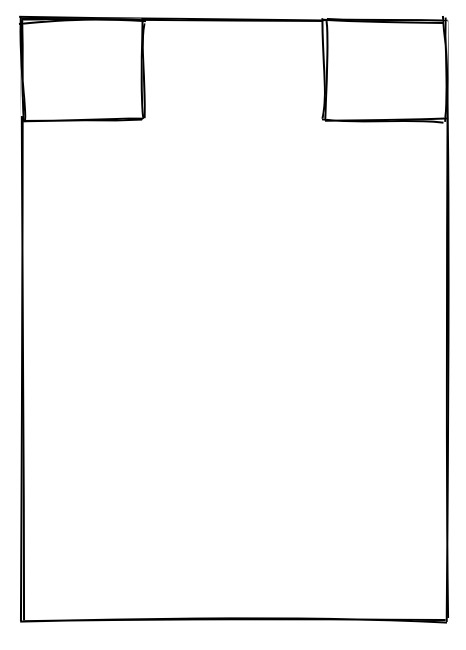
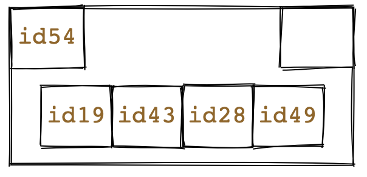
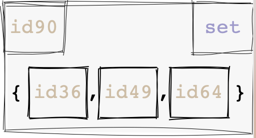

## About

In case the user does not want to get their hands dirty with specific DOM (and RoughJS) attributes
for configuring the style of an object, they have the option specify a present, which represents
an umbrella of different styling attributes that are combined to produce a particular effect, such
as "highlighting" an object, or "hiding" a particular component of it.

To declare the desired preset, the user must assign it to the `style` attribute
(e.g. `style: "highlight"`).

## Explanation

### `highlight`

When the keyword `highlight` is provided as the value for the `style` attribute, there will be significant
changes on the appearance of the container. In terms of the boxes (the container representing the data, the id box
if applicable and the type box), the lines will be bolder, and there will be less roughness (lines would be more still
than usual). In terms of the texts (the text representing the id, type and the value), the font size will be bigger,
and they will appear bolder than default.

### `highlight_id`

When the keyword `highlight_id` is provided as the value for the `style` attribute, there will be significant
changes on the appearance of the container. In terms of the id box the lines will be bolder, and there will be
less roughness (lines would be more still than usual). In terms of the id text, the font size will be bigger, and it
will appear bolder than default.

### `highlight_type`

When the keyword `highlight_type` is provided as the value for the `style` attribute, there will be significant
changes on the appearance of the container. In terms of the type box the lines will be bolder, and there will be
less roughness (lines would be more still than usual). In terms of the type text, the font size will be bigger, and it
will appear bolder than default.

### `hide`

It makes all three major boxes (type box, id box, and the surrounding container box) all blank (white).

### `hide_id`

It will make the id box blank (white).

### `hide_type`

It will make the type box blank (white).

### `hide_container`

It will make the container box blank (white), but not the `type` and `id` boxes.
(NOTE: this is not currently supported for sequences).

### `fade`

It will "fade" the box.

### `fade_type`

It will "fade" the type sub-box.

### `fade_id`

It will "fade" the id sub-box.

## A combination of various presets and user-defined styles, with `style: ["highlight", "hide_type", {"text_id" : {"font-style" : "italic"}}]`

## Implementation Note

In regard to implementation, the array of "presets" is resolved into a single JS style object, with the help of the
`deepmerge` library.
Once the style attribute has been assigned to the appropriate object, we call
the `populateDefaultStyle` function, simply to complement with any default attributes
that are not there.
