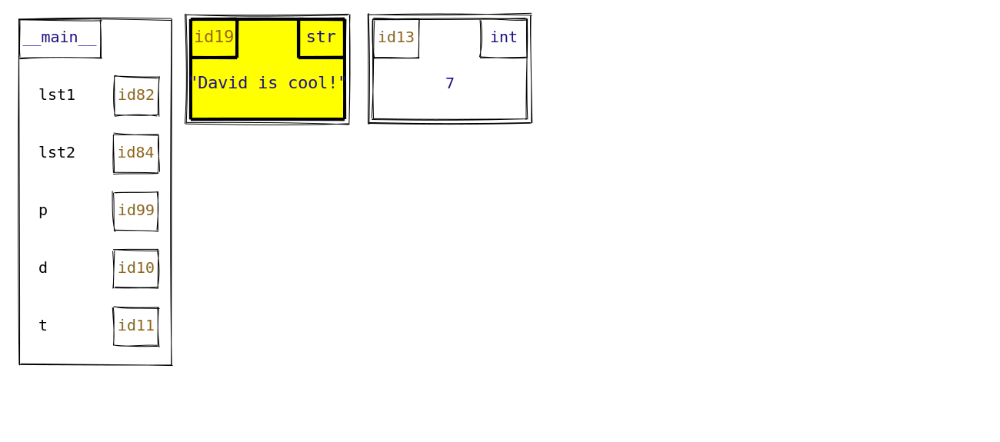

# MemoryViz: Creating memory model diagrams

This package generates memory model diagrams for Python code in the style of CSC110/111/148 at the University of Toronto.
This uses the [Rough.js](https://roughjs.com/) Javascript library to emulate the look of hand-drawn diagrams.

**Note**: this project is currently experimental, and may undergo significant changes before stabilizing.

## Installation (users)

1. Install [Node.js](https://nodejs.org/en/).
2. Install the `memory-viz` package:

    ```console
    $ npm install memory-viz
    ```

## Sample usage

Running the following file:

```js
const { draw } = require("memory-viz");

const objects = [
    {
        type: ".frame",
        name: "__main__",
        id: null,
        value: { lst1: 82, lst2: 84, p: 99, d: 10, t: 11 },
    },
    {
        type: "str",
        id: 19,
        value: "David is cool!",
        style: ["highlight"],
    },
    {
        type: "int",
        id: 13,
        value: 7,
    },
];

const m = draw(objects, true, { width: 1300 });

m.save("simple_demo.svg");
```

produces a file `simple_demo.svg` that looks like the following:



For more information, check out the project [documentation website](https://www.cs.toronto.edu/~david/memory-viz/) and [demo](https://www.cs.toronto.edu/~david/memory-viz/demo/).

### MemoryViz CLI

To use the MemoryViz CLI, run:

```console
$ npx memory-viz <path-to-file>
```

where `<path-to-file>` is the path to a file containing MemoryViz-compatible JSON. If a file path is not provided, the CLI will take input from standard input.

You may also specify an output path using the `--output` option (see documentation). If no output path is provided, the CLI will print to standard output.

_Note_: The CLI currently does not support typing input directly into the terminal. Instead, use piping or other strategies to pass data into standard input.

For more information, check out the project [documentation website](https://www.cs.toronto.edu/~david/memory-viz/docs/cli).

## Developers

### Installation

1. First, clone this repository.
2. Install [Node.js](https://nodejs.org/en/).
3. Open a terminal in your local code of the repository, and then run:

    ```console
    $ npm install
    ```

4. Compile the Javascript assets using [webpack](https://webpack.js.org/guides/getting-started/):

    ```console
    $ npm run build-dev --workspace=memory-viz
    ```

5. Install the pre-commit hooks to automatically format your code when you make commits:

    ```console
    $ npx husky install
    $ npm pkg set scripts.prepare="husky install"
    $ npx husky add .husky/pre-commit "npx lint-staged"
    ```

### Automatic Javascript compilation

Rather than running `npm run build-dev` to recompile your Javascript bundle every time you make a change, you can instead run the following command:

```console
$ npm run watch --workspace=memory-viz
```

This will use `webpack` to watch for changes to the Javascript source files and recompile them automatically.

_Note_: this command will keep running until you manually terminate it (Ctrl + C), and so you'll need to open a new terminal window to enter new terminal commands like running the demo below.

### Running tests

To run the test suite, execute the following command:

```console
$ npm run test --workspace=memory-viz
```
